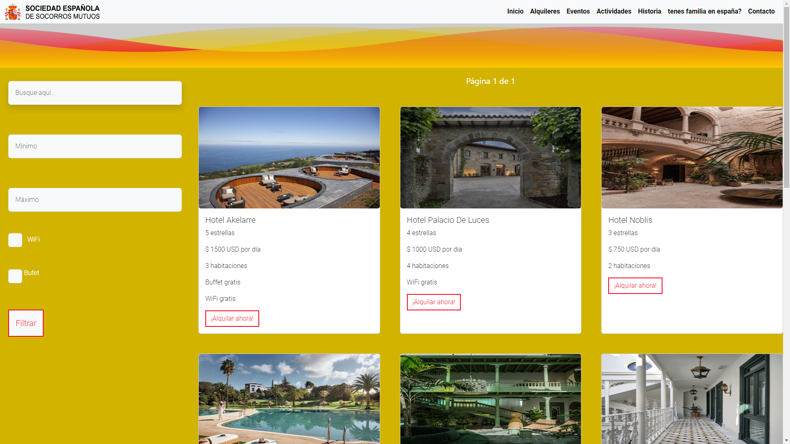
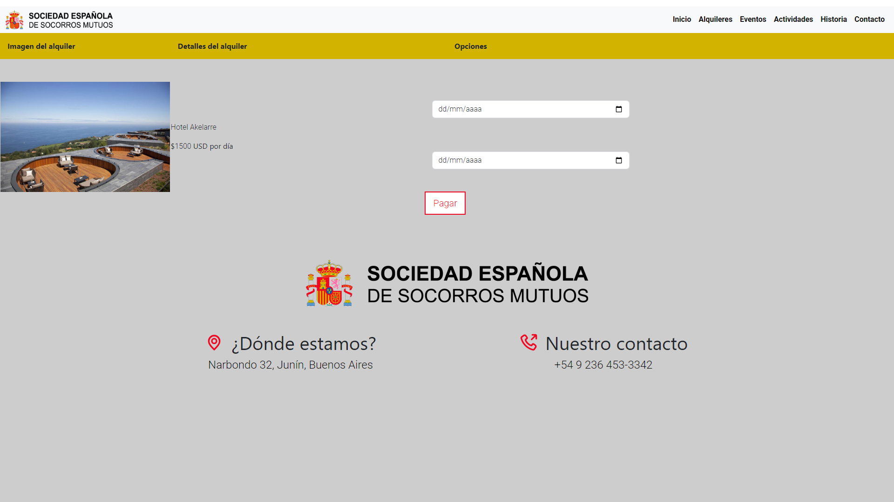
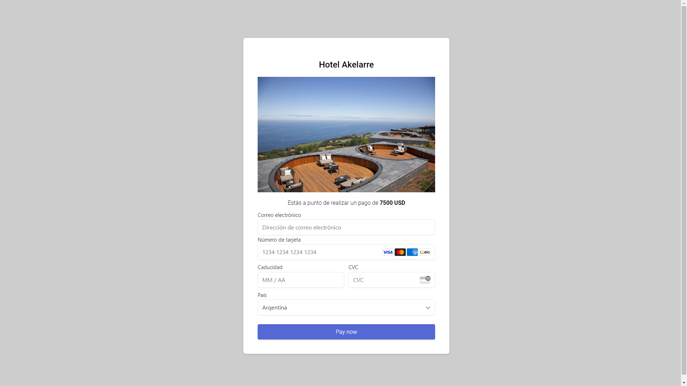

# Final POO

This is a project to take the final of Object Oriented Programming (OOP)

## Screenshots






## Tools Used

- Spring boot with maven
- Postgresql
- Stripe (payment)


## Environment Variables

To run this project, you will need to modify your application.properties file:

`spring.datasource.url`

`spring.datasource.username`

`spring.datasource.password`

`spring.mail.username`

`spring.mail.password`

`stripe.api.publicKey`

`stripe.api.secretKey`


## Run Application

```bash
  mvn spring-boot:run
```

## Authors

- [@Juan Ignacio Caprioli (ChanoChoca)](https://github.com/ChanoChoca)
- [@José Matías Fernandez (JmatiF)](https://github.com/JmatiF)


## Badges

[//]: # (Add badges from somewhere like: [shields.io]&#40;https://shields.io/&#41;)

[](https://choosealicense.com/licenses/mit/)
[](https://opensource.org/licenses/)
[](http://www.gnu.org/licenses/agpl-3.0)
